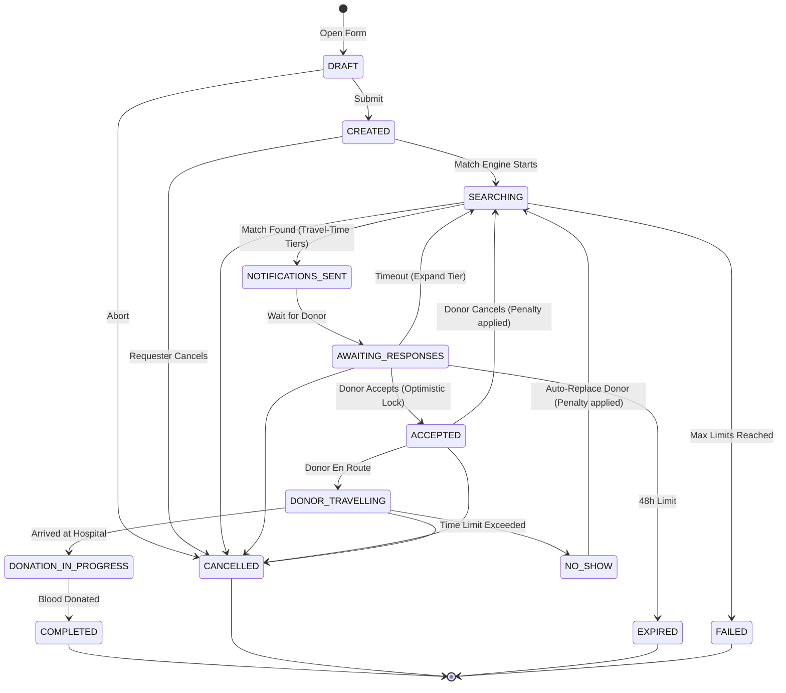
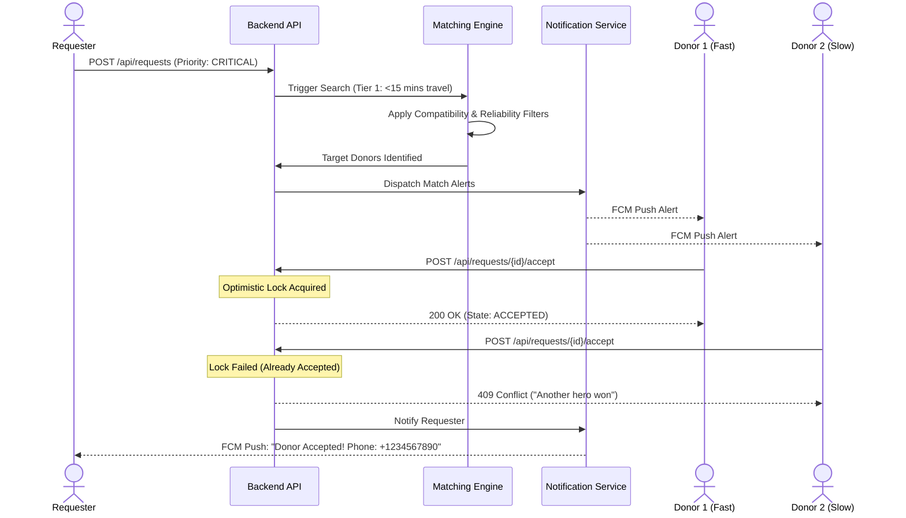

# Emergency Request Workflow Specification

## 1. Vision
**Problem Statement:** During medical crises, locating eligible blood donors relies heavily on unstructured, manual social media requests. This leads to dangerous delays, privacy violations, donor fatigue, and low success rates.
**Goals:** Minimize the time to locate and dispatch a verified, eligible blood donor to under 15 minutes through autonomous, deterministic spatial matching.
**Success Metrics:** 
- Match found in < 15 minutes for 85% of requests.
- Donor arrival at hospital in < 60 minutes for 80% of matches.
- Zero privacy leaks regarding patient contact information.
**MVP Scope:** Single requester to single donor matching via push notifications and strict distance-based searching.
**Out of Scope:** AI-driven predictive matching, hospital EHR integration, dynamic blood bank inventory polling, and volunteer organization dashboards.

---

## 2. Actors
### Current Actors
- **Requester:** Creates the emergency request, provides patient details and hospital location, tracks status, and confirms donation completion.
- **Donor:** Receives emergency alerts, accepts/declines requests, travels to the hospital, and donates blood.
- **Admin:** Monitors global request health, handles manual escalations, resolves disputes, and bans abusive users.

### Future Actors
- **Hospital:** Automatically generates requests based on internal inventory levels.
- **Blood Bank:** Fulfills requests directly if inventory is available before pinging individual donors.
- **Volunteer Organization:** Organizes localized blood drives and manages clusters of donors.

---

## 3. Emergency Priority Levels
To ensure the Matching Engine prioritizes appropriately, all requests are categorized by severity:
- **Planned:** Routine requirements for scheduled surgeries (weeks in advance).
- **Scheduled:** Required within the next 48 hours.
- **Emergency:** Urgent requirement within 24 hours.
- **Critical:** Immediate, life-threatening situation (required in under 1-2 hours).
- **Mass Casualty (Future):** Overrides standard concurrency and throttling limits to dispatch blast alerts globally across an entire region.

---

## 4. Emergency Request Lifecycle & State Machine
The system relies on a strict state machine to govern the lifecycle of a request. 

### Core States
| State | Description | Entry Conditions | Exit Conditions |
| :--- | :--- | :--- | :--- |
| **DRAFT** | Form creation. | User opens "New Request". | Form is submitted. |
| **CREATED** | Saved to DB. | Form submitted. | Match Engine starts. |
| **SEARCHING** | Engine is executing queries. | Matching triggered. | Donors identified or max threshold reached. |
| **NOTIFICATIONS_SENT** | Push alerts dispatched. | Target pool created. | System enters wait state. |
| **AWAITING_RESPONSES** | Waiting for Donor action. | Notifications pushed. | Donor accepts OR Timeout. |
| **ACCEPTED** | Donor locked to request. | First donor taps "Accept".| Donor taps "Start Travel". |
| **DONOR_TRAVELLING** | Donor en route. | Travel started. | Donor arrives at Hospital. |
| **DONATION_IN_PROGRESS**| Donor is donating. | Arrival confirmed. | Donation verified complete. |
| **COMPLETED** | Donation successful. | Both parties confirm. | Terminal State. |

### Failure / Alternative States
| State | Description | Resolution Actions |
| :--- | :--- | :--- |
| **CANCELLED** | User or system aborted request. | Terminal State. Notify accepted donor if applicable. |
| **EXPIRED** | Time limit exceeded without a match. | Terminal State. |
| **FAILED** | Technical failure or validation abort. | Terminal State. |
| **NO_SHOW** | Donor failed to arrive in time. | Target donor penalized; request auto-reverts to `SEARCHING`. |

### Transition Rules
- **Allowed Transitions:** Forward progression along the happy path (e.g., `ACCEPTED` → `DONOR_TRAVELLING`).
- **Forbidden Transitions:** Bypassing phases (e.g., `SEARCHING` directly to `COMPLETED`), or backwards transitions (e.g., `DONOR_TRAVELLING` back to `ACCEPTED`).
- **Automatic Transitions:** `AWAITING_RESPONSES` → `SEARCHING` (if no response within tier time limit).
- **Timeout Transitions:** `DONOR_TRAVELLING` → `NO_SHOW` (if estimated travel time + 45 minute buffer is exceeded).

---

## 5. Business Rules
### Centralized Blood Compatibility Rule Set
Matching is strictly governed by a centralized biological matrix (not scattered if/else logic):
- **O- (Universal Donor):** Can give to ANY type. Can receive ONLY O-.
- **O+:** Can give to O+, A+, B+, AB+. Can receive O+, O-.
- **A+:** Can give to A+, AB+. Can receive A+, A-, O+, O-.
- **A-:** Can give to A+, A-, AB+, AB-. Can receive A-, O-.
- **B+:** Can give to B+, AB+. Can receive B+, B-, O+, O-.
- **B-:** Can give to B+, B-, AB+, AB-. Can receive B-, O-.
- **AB+ (Universal Recipient):** Can give to AB+. Can receive ANY type.
- **AB-:** Can give to AB+, AB-. Can receive AB-, A-, B-, O-.

### Expansion Logic: Travel-Time Based Routing
Instead of fixed geographic radii (which fail in dense urban environments due to traffic and geography), expansion relies on **Travel Time (Isochrones)**.
- **Tier 1:** Donors within `< 15 mins` estimated travel time (via Distance Matrix API/Routing Engine).
- **Tier 2:** Donors within `< 30 mins`.
- **Tier 3:** Donors within `< 60 mins`.
*Conceptual Execution:* The PostGIS database pre-filters donors using a generous bounding box, and the engine rapidly calculates estimated travel times for the subset before notifying them.

### "No Show" Workflow
- **Automatic Timeout:** When a donor enters `DONOR_TRAVELLING`, a countdown begins based on the estimated travel time + a 45-minute grace buffer.
- **Auto Replacement:** If the donor does not transition to `DONATION_IN_PROGRESS` before the timeout, the system assumes a "No Show". The request auto-resumes the `SEARCHING` state.
- **Penalty:** The offending donor is heavily penalized.

---

## 6. Reliability Score Model
To ensure high-quality matching, every donor maintains a dynamic Reliability Score (0 to 100).
- **Initial Score:** 100 (Assigned upon basic verification).
- **Reward Events:**
  - Successful Donation (`COMPLETED`): +10 points (Max 100).
- **Penalty Events:**
  - Ignoring requests: No penalty (volunteer freedom).
  - Excessive manual declines (e.g., >5 in a month): -5 points.
  - Cancelling after accepting: -30 points.
  - "No Show" (Timeout while travelling): -50 points.
- **Future Integration:** The Matching Engine will use this score as a primary weight when ranking donors in the `SEARCHING` phase, ensuring the most reliable donors are pinged first. (Donors < 50 score may require Admin review).

---

## 7. Matching Workflow & Concurrency
1. **Request Created** and assigned a Priority Level.
2. **Determine Travel Tier** (starts at <15 mins).
3. **Filter by Eligibility**: Centralized blood rules, 90-day cooldown, and global availability.
4. **Rank Donors**: Sorted by Reliability Score (Primary) and Travel Time (Secondary).
5. **Dispatch Notifications**: Send push alerts to the target batch.
6. **Concurrency Handling (The Race):**
   - The first donor to accept sends a POST `/accept`. The database executes an Optimistic Lock (`@Version`).
   - The first transaction succeeds and the state transitions to `ACCEPTED`.
   - Remaining donors who attempt to accept will encounter a 409 Conflict. The UI gracefully catches this and displays: *"Thank you! Another hero got there first."*
7. **Silent Cleanup**: Pushes are dispatched to unaccepted devices to clear the request from their UI.

---

## 8. Notification Workflow
- **Requester Triggers:** Request Created, Donor Accepted (reveals Donor ID), Request Expiring, No-Show Re-search.
- **Donor Triggers:** Urgent Push Notification for Match, Stand Down (Request fulfilled by someone else), "No Show" Warning (10 mins before penalty), Successful Donation Confirmation.
- **Admin Triggers:** Anomalous behavior (e.g., 3 consecutive No-Shows by a single user).

---

## 9. Privacy Rules
- **Pre-Acceptance:** Requester phone number, precise identity, and patient identity are strictly masked. Donors only see Hospital Name and Blood Group.
- **Post-Acceptance:** Contact information is mutually exchanged ONLY after the state reaches `ACCEPTED`.
- **Revocation:** Phone numbers and chat features are completely locked 24 hours after a `COMPLETED` or `CANCELLED` transition.

---

## 10. Failure Scenarios
- **Network Failure During Acceptance:** Handled via local Flutter queueing. If the lock is already taken when connectivity resumes, UI reverts gracefully.
- **Requester Cancels Post-Acceptance:** Push notification sent to the accepted donor to stand down immediately.
- **Donor Cancels Post-Acceptance:** Donor Reliability Score is penalized; request immediately reverts to `SEARCHING` at the current travel-time tier.

---

## 11. Mermaid State Diagram

---

## 12. Mermaid Sequence Diagram

---

## 13. Future Scalability
As the platform expands beyond the V1 MVP, this workflow will natively support:
- **Hospitals & Blood Banks:** B2B API integrations to inject automated `CRITICAL` priority requests based on blood fridge IoT sensors.
- **Volunteer Organizations:** Organization Admins acting as a proxy layer, intercepting requests to coordinate a team of donors simultaneously.
- **AI Matching:** Deep learning models replacing static travel-time tiers with predictive analysis of donor willingness, weather conditions, and real-time traffic to calculate the highest probability of fulfillment.
- **Regional Dispatch Centers:** Manual override controls for regional operators during catastrophic events (`Mass Casualty` priority).

---

## 14. Dependencies
- **Database:** Transaction isolation levels for locking, PostGIS for bounding box approximations.
- **Backend:** State machine library (e.g., Spring State Machine), Async scheduling for travel-time recalculations.
- **Maps API:** Google Maps Distance Matrix or OSRM for isochrone / travel-time calculations.

---

## 15. Risks & Mitigations
- **Travel Time API Costs:** High-frequency calls to Google Maps API during the `SEARCHING` phase could incur massive costs.
  - *Mitigation:* Use PostGIS `ST_DWithin` bounding boxes to filter the candidate pool to < 100 donors before calling routing APIs, or use a self-hosted OSRM engine.
- **Concurrency Bottlenecks:** Row-level locks slowing down the database during large broadcasts.
  - *Mitigation:* Employ robust `@Version` optimistic locking over pessimistic locking.
